Vega.jl
=======

# NOTICE

**5/20/2015: This package is being revived by [Randy Zwitch](https://github.com/randyzwitch) for v0.4. Its reliability is still in flux, but should work in Jupyter Notebook and from the REPL**

# Introduction

A Julia package for creating the simplest kinds of Vega visualizations. We currently support barebones versions of the following:

* Area plots
* Bar plots/Histograms
* Line plots
* Scatter plots
* Pie/Donut charts

In addition, this package wraps Vega's pseudo-type system inside of Julia types. This will eventually provide tools for manipulating graphics with a higher level of control over layout.

# Installation

This package depends upon [Vega.js](https://github.com/trifacta/vega) from Trifacta and is provided automatically within Vega.jl. If you want to upgrade the library yourself, be sure that the file structure remains the same (and, submit a pull request here!)

	Pkg.add("Vega")
	using Vega

# Usage Examples

The current API provides some convenience wrappers around Vega for generating standard kinds of plots. These are described below. If you have any issues with the examples, please try checking out master for `Distributions`, `Grid`, `Optim` and `KernelDensity`. While these packages aren't requirements to use Vega.jl, they are used for generating data to plot in the examples.

	using Distributions
	using Vega

	plot(x = [1, 2, 3, 4, 5],
		 y = [1, 2, 3, 2, 1],
		 kind = :bar)

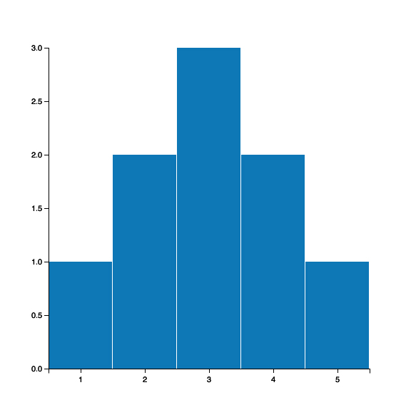

	srand(1)
	plot(x = [1:20],
		 y = rand(20),
		 kind = :bar)

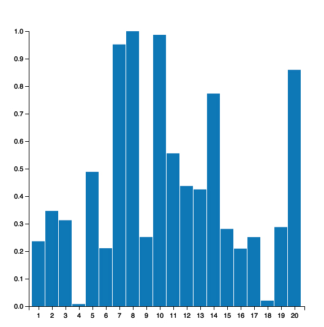

	plot(x = [1:20],
		 y = rand(20),
		 group = vcat([1 for i in 1:10], [2 for i in 1:10]),
		 kind = :bar)

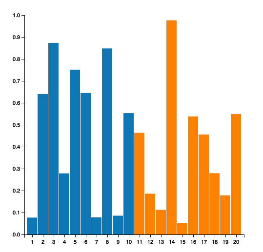

	plot(x = [1:100, 1:100],
		 y = [[1:100] + randn(100), 3.0 + 1.5 * [1:100] + randn(100)],
		 group = [[1 for i in 1:100], [2 for i in 1:100]],
		 kind = :line)

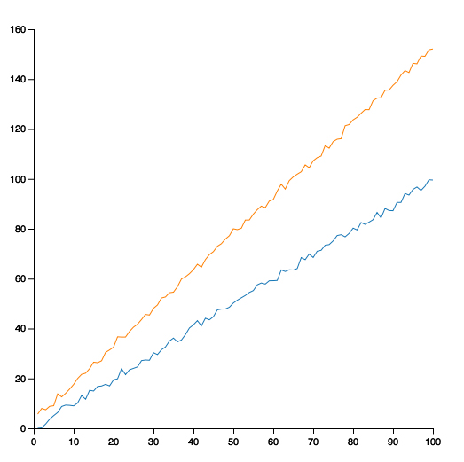

	d1 = MultivariateNormal([0.0, 0.0], [1.0 0.9; 0.9 1.0])
	d2 = MultivariateNormal([10.0, 10.0], [4.0 0.5; 0.5 4.0])
	points = vcat(rand(d1, 500)', rand(d2, 500)')
	x = points[:, 1]
	y = points[:, 2]
	plot(x = x, y = y,
		 group = vcat(ones(Int, 500), ones(Int, 500) + 1),
		 kind = :scatter)

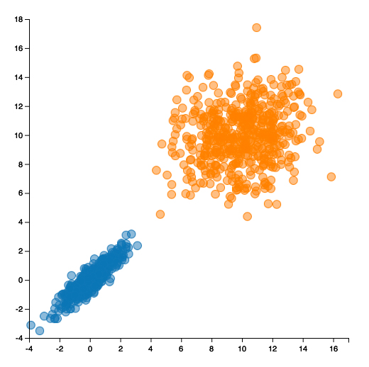

	using KernelDensity
	x = rand(Gamma(1.0, 1.0), 1_000_000)
	k = kde(x)
	plot(x = k.x, y = k.density, kind = :area)

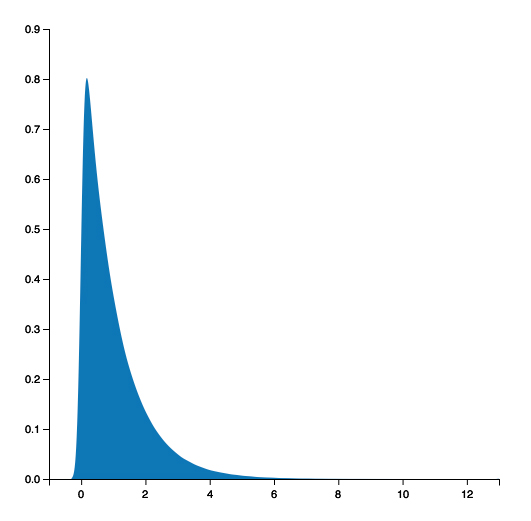

	x = rand(Beta(3.0, 2.0), 1_000_000)
	k = kde(x)
	plot(x = k.x, y = k.density, kind = :area)

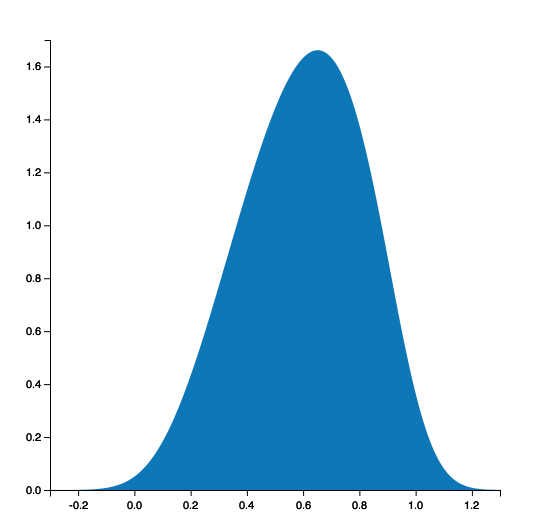

	n = 30
	x = Array(Int, n^2)
	y = Array(Int, n^2)
	color = Array(Int, n^2)
	t = 0
	for i in 1:n
	    for j in 1:n
	        t += 1
	        x[t] = i
	        y[t] = j
	        color[t] = Int(rand() > 0.5)
	    end
	end
	heatmap(x = x, y = y, group = color)

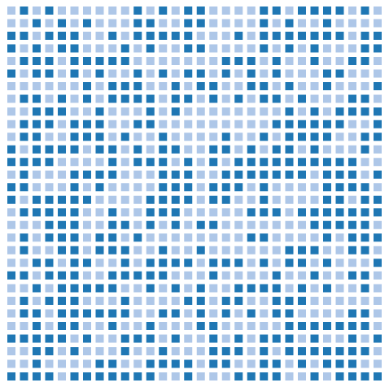

	fruit = ["peaches", "plums", "blueberries", "strawberries", "bananas"]
	bushels = [100, 32, 180, 46, 21]
	plot(x = fruit, y = bushels, kind = :pie)

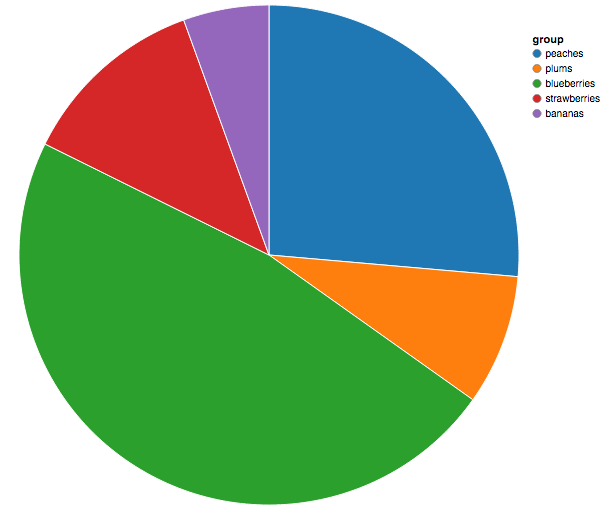

	plot(x = fruit, y = bushels, kind = :donut)

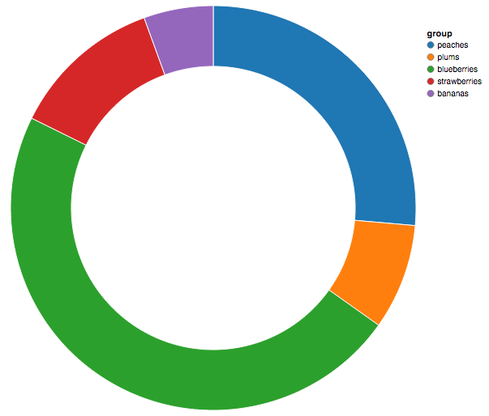

	x = rand(Gamma(3.0, 1.0), 1_000_000)
	v = histogram(x = x, relativefreq = true)
	hidelegend!(v)
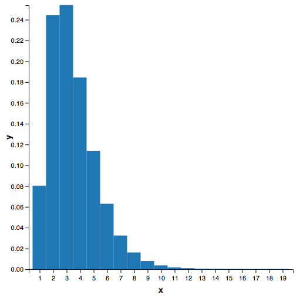

	using DataFrames, JSON
	df = DataFrame()
	for p in JSON.parse(readall(Pkg.dir("Vega", "deps/vega/examples/data/population.json")))
	    df = vcat(df, DataFrame(;[symbol(k)=>v for (k,v) in p]...))
	end
	pop1900 = df[df[:year] .== 1900, :];
	x = pop1900[:people]
	y = pop1900[:age]
	group = pop1900[:sex]
	popchart(x = x, y = y, group = group)
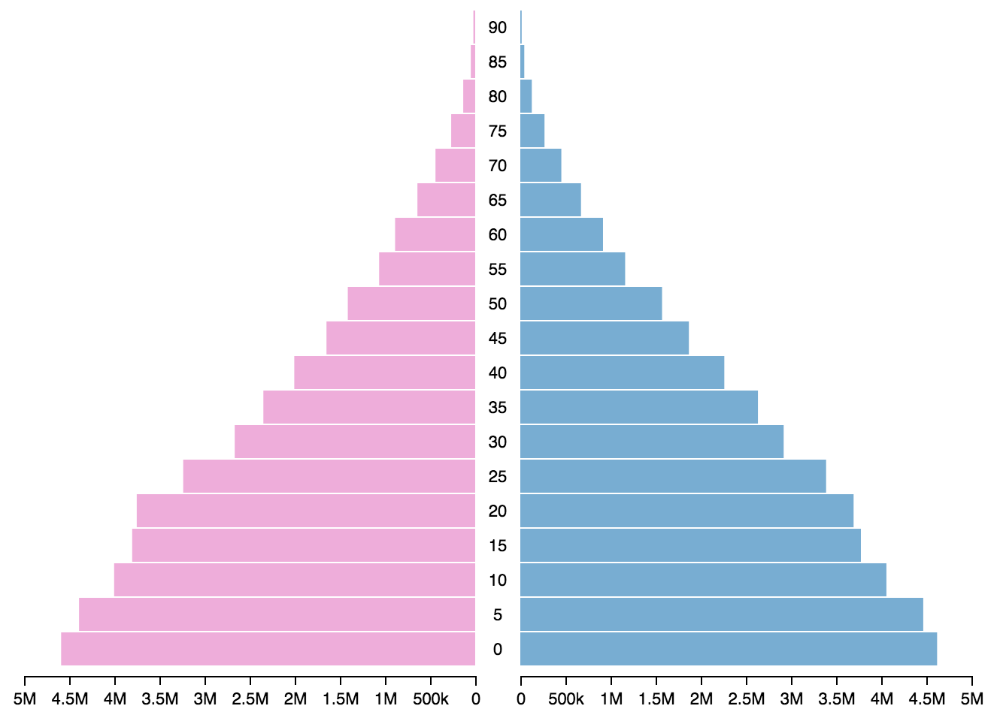