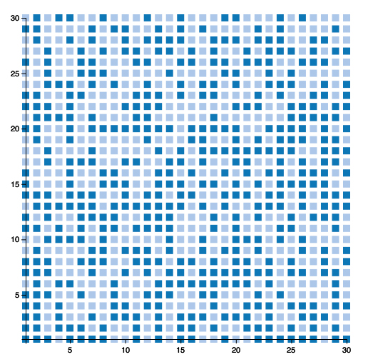

Vega.jl
=======

# NOTICE

**This package is unmaintained. Its reliability is not guaranteed.**

# Introduction

A Julia package for creating the simplest kinds of Vega visualizations. We currently support barebones versions of the following:

* Area plots
* Bar plots
* Line plots
* Scatter plots

In addition, this package wraps Vega's pseudo-type system inside of Julia types. This will eventually provide tools for manipulating graphics with a higher level of control over layout.

# Installation

Because this package depends upon Vega, Vega is provided as a Git submodule of Vega.jl. When you first install this repo from GitHub, you must then take additional steps to install the Vega submodule. This can be done by running the following commands:

	using Vega
	Vega.install()

This will download and install the appropriate release of Vega for you automatically.

# Usage Examples

The current API provides some convenience wrappers around Vega for generating standard kinds of plots. These are described below.

	using Distributions
	using Vega

	plot(x = [1, 2, 3, 4, 5],
		 y = [1, 2, 3, 2, 1],
		 kind = :bar)

	srand(1)
	plot(x = [1:20],
		 y = rand(20),
		 kind = :bar)

	plot(x = [1:20],
		 y = rand(20),
		 group = vcat([1 for i in 1:10], [2 for i in 1:10]),
		 kind = :bar)

	plot(x = [1:100, 1:100],
		 y = [[1:100] + randn(100), 3.0 + 1.5 * [1:100] + randn(100)],
		 group = [[1 for i in 1:100], [2 for i in 1:100]],
		 kind = :line)

	d1 = MultivariateNormal([0.0, 0.0], [1.0 0.9; 0.9 1.0])
	d2 = MultivariateNormal([10.0, 10.0], [4.0 0.5; 0.5 4.0])
	points = vcat(rand(d1, 500)', rand(d2, 500)')
	x = points[:, 1]
	y = points[:, 2]
	plot(x = x, y = y,
		 group = vcat(ones(Int, 500), ones(Int, 500) + 1),
		 kind = :scatter)

	x = rand(Gamma(1.0, 1.0), 1_000_000)
	k = kde(x, 0.1, 2048)
	plot(x = k.x, y = k.density, kind = :area)

	x = rand(Beta(3.0, 2.0), 1_000_000)
	k = kde(x, 0.1, 2048)
	plot(x = k.x, y = k.density, kind = :area)

	n = 30
	x = Array(Int, n^2)
	y = Array(Int, n^2)
	color = Array(Int, n^2)
	t = 0
	for i in 1:n
		for j in 1:n
			t += 1
			x[t] = i
			y[t] = j
			color[t] = int(rand() > 0.5)
		end
	end
	heatmap(x = x, y = y, color = color)

